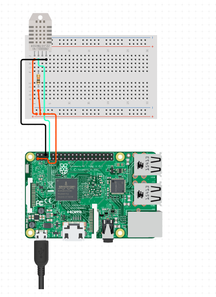

# Project Prototype

This is our Software Lab project goal is to get, store, and show the data from our crops using IoT.

This project has different phases:
1. Data collection is dealt with inside the raspberry pi and processed on it.
2. REST API  the data is transferred to an API that will save our data on a Oracle database.
3. Javascript, HTML and CSS which will be able to show all the data to the end-user  

 

## Getting Started

These instructions will get you a copy of the project up and running on your local machine for development and testing purposes. See deployment for notes on how to deploy the project on a live system.

### Prerequisites

```
Java 1.8
Python 3.7
Bootstrap 4
```

### Installing

You need to configure your raspberry client.

 
```
Running the code inside the Client folder
```

Once that is done you can check on the website that all the data is available

## Repository

https://github.com/alexindris/Project_Prototype

## Built With

* [Gradle](https://gradle.org/) - Dependency Management
* [Spring](https://spring.io/) - Frame Work
* [Oracle](https://www.oracle.com/) - Database


## Versioning


## Authors

* **NOELIA MUÑOZ** - *DDBB INTEGRATION work* - [NoeliaMGU](https://github.com/NoeliaMGU)

* **MARTA ORTUÑO** - *CLIENT SIDE work* - [MartaOG](https://github.com/MartaOG)

* **ÀLEX TELLO** - *API REST development* - [Alexindris](https://github.com/alexindris)
